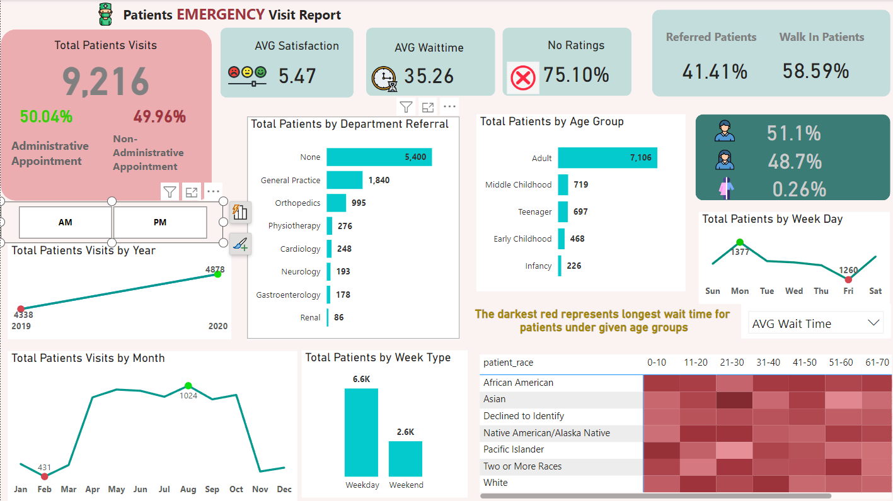

# Emergency Visit Dashboard

This project is an interactive **Emergency Patient Visit Report Dashboard**, which visualizes various statistics and insights related to patient visits to an emergency department.

## Dashboard Overview

- **Total Patients Visits**: Displays total visits (9,216), broken down into administrative and non-administrative appointments.
- **Average Satisfaction**: Shows average patient satisfaction (5.47 out of 10).
- **Average Wait Time**: The average waiting time for patients is 35.26 minutes.
- **Referral by Department**: Most patients (5,400) were not referred to any department, but other common referrals include General Practice (1,840), Orthopedics (995), and Physiotherapy (276).
- **Age Groups**: Majority of patients are adults (7,106), with significant numbers in childhood and teenage age groups as well.
- **Gender Distribution**: Gender breakdown shows 51.1% male, 48.7% female, and 0.26% non-binary or declined to identify.
- **Race and Wait Time**: The heatmap visualizes wait times across different age groups and patient race categories.
- **Visits by Time**: The dashboard also highlights patient visits by year, month, and weekday, showing peak periods in patient flow.

## Key Visualizations

- **Patient Satisfaction & Wait Times**: This helps in identifying trends in patient experience.
- **Departmental Referrals**: Provides insight into which departments handle the majority of patients.
- **Age Group Analysis**: Breaks down the patient population by different age categories.
- **Race and Wait Time Heatmap**: Shows the average waiting time for different races across various age groups. Darker red indicates longer waiting times.
- **Patient Visits Over Time**: Trends in the number of visits over the year, month, and weekdays.

## Tools Used

- **Power BI**: The dashboard was built using Power BI for data visualization.
  

